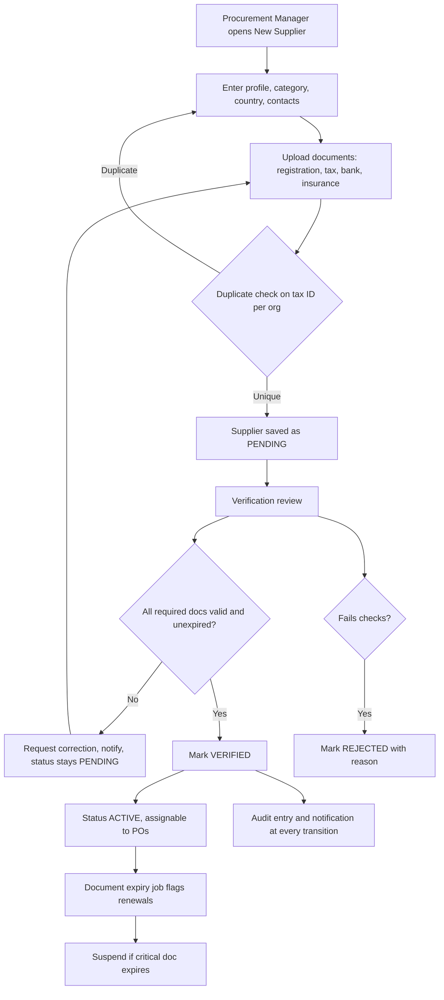
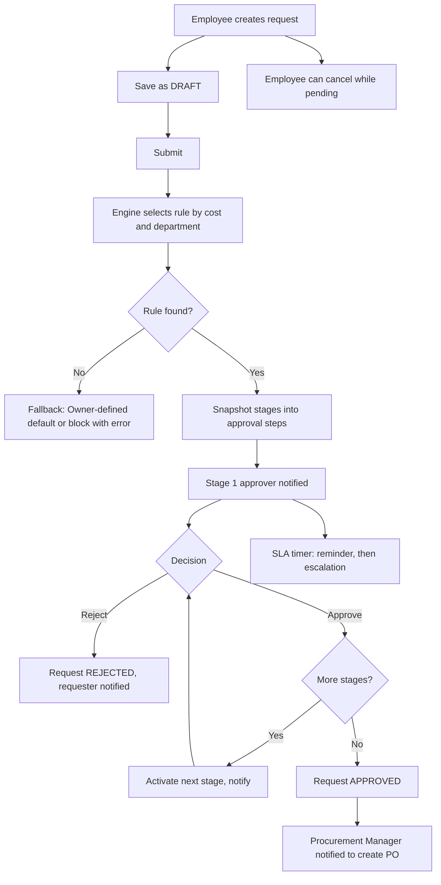
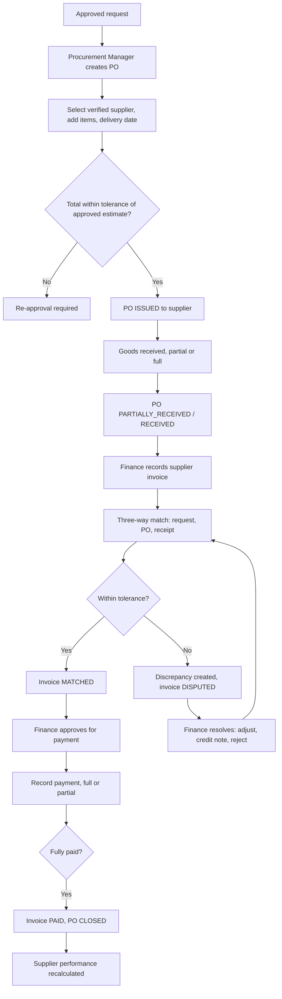

# 02. User Journey Diagrams

## Journey 1: Supplier onboarding

```mermaid
flowchart TD
  A[Procurement Manager opens New Supplier] --> B[Enter profile, category, country, contacts]
  B --> C[Upload documents: registration, tax, bank, insurance]
  C --> D{Duplicate check on tax ID per org}
  D -- Duplicate --> B
  D -- Unique --> E[Supplier saved as PENDING]
  E --> F[Verification review]
  F --> G{All required docs valid and unexpired?}
  G -- No --> H[Request correction, notify, status stays PENDING]
  H --> C
  G -- Yes --> I[Mark VERIFIED]
  F --> J{Fails checks?}
  J -- Yes --> K[Mark REJECTED with reason]
  I --> L[Status ACTIVE, assignable to POs]
  L --> M[Document expiry job flags renewals]
  M --> N[Suspend if critical doc expires]
  I --> O[Audit entry and notification at every transition]
```

## Journey 2: Purchase request approval

```mermaid
flowchart TD
  A[Employee creates request] --> B[Save as DRAFT]
  B --> C[Submit]
  C --> D[Engine selects rule by cost and department]
  D --> E{Rule found?}
  E -- No --> F[Fallback: Owner-defined default or block with error]
  E -- Yes --> G[Snapshot stages into approval steps]
  G --> H[Stage 1 approver notified]
  H --> I{Decision}
  I -- Reject --> J[Request REJECTED, requester notified]
  I -- Approve --> K{More stages?}
  K -- Yes --> L[Activate next stage, notify]
  L --> I
  K -- No --> M[Request APPROVED]
  M --> N[Procurement Manager notified to create PO]
  H --> O[SLA timer: reminder, then escalation]
  A --> P[Employee can cancel while pending]
```

## Journey 3: Purchase order and invoice processing

```mermaid
flowchart TD
  A[Approved request] --> B[Procurement Manager creates PO]
  B --> C[Select verified supplier, add items, delivery date]
  C --> D{Total within tolerance of approved estimate?}
  D -- No --> E[Re-approval required]
  D -- Yes --> F[PO ISSUED to supplier]
  F --> G[Goods received, partial or full]
  G --> H[PO PARTIALLY_RECEIVED / RECEIVED]
  H --> I[Finance records supplier invoice]
  I --> J[Three-way match: request, PO, receipt]
  J --> K{Within tolerance?}
  K -- Yes --> L[Invoice MATCHED]
  K -- No --> M[Discrepancy created, invoice DISPUTED]
  M --> N[Finance resolves: adjust, credit note, reject]
  N --> J
  L --> O[Finance approves for payment]
  O --> P[Record payment, full or partial]
  P --> Q{Fully paid?}
  Q -- Yes --> R[Invoice PAID, PO CLOSED]
  R --> S[Supplier performance recalculated]
```
